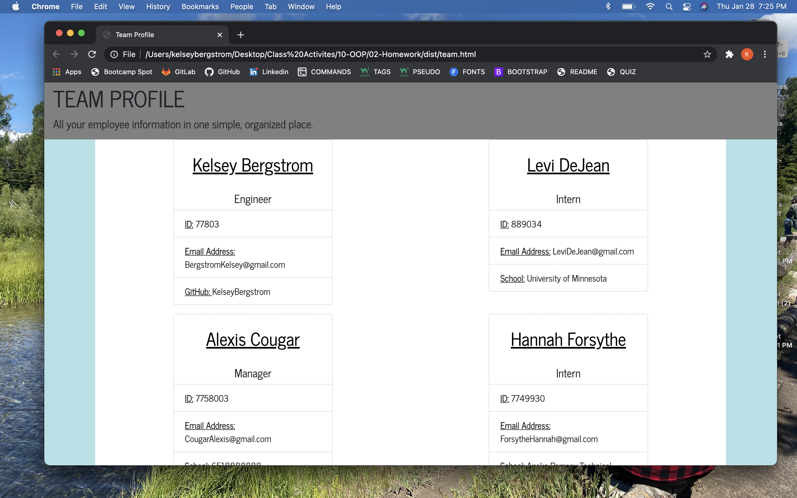
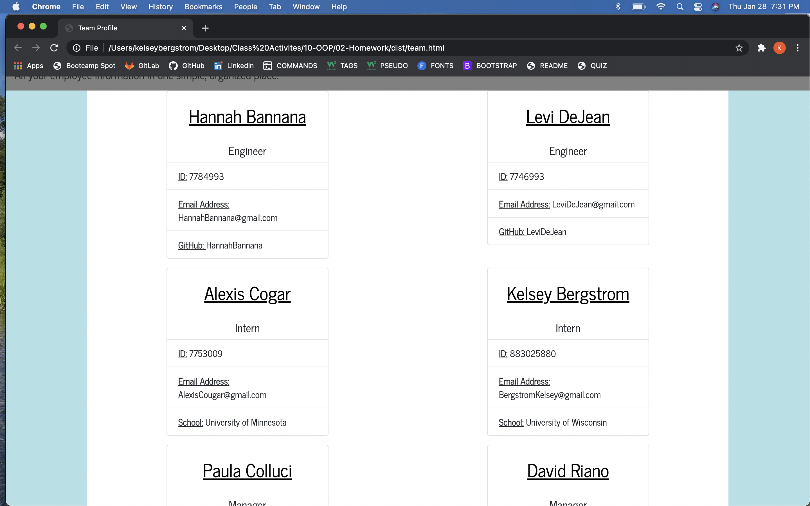

# TeamProfileAssignmnt

This application is made for the use of companies with many employees, who want to organize the employee data in one simple, easy spot. Team Profile builder takes input from the user/employee, such as Name, Company Role, ID Number, GitHub Username and Email address, and compiles them onto on HTML page for easier access for all company employees.

This was a very challening project for myself and most my classmates. I am happy to have taken the time to figure this out, things are clicking, like our instructors said they would. I do not however, fully understand testing in node, and hope to understand that more fully before I can confidently add that aspect to this project.

To use, simply open this project using node, and enter input in the command line. User will be prompted questions and answers will be appended onto an automated HTML when done. Add as many employees as you would like!

